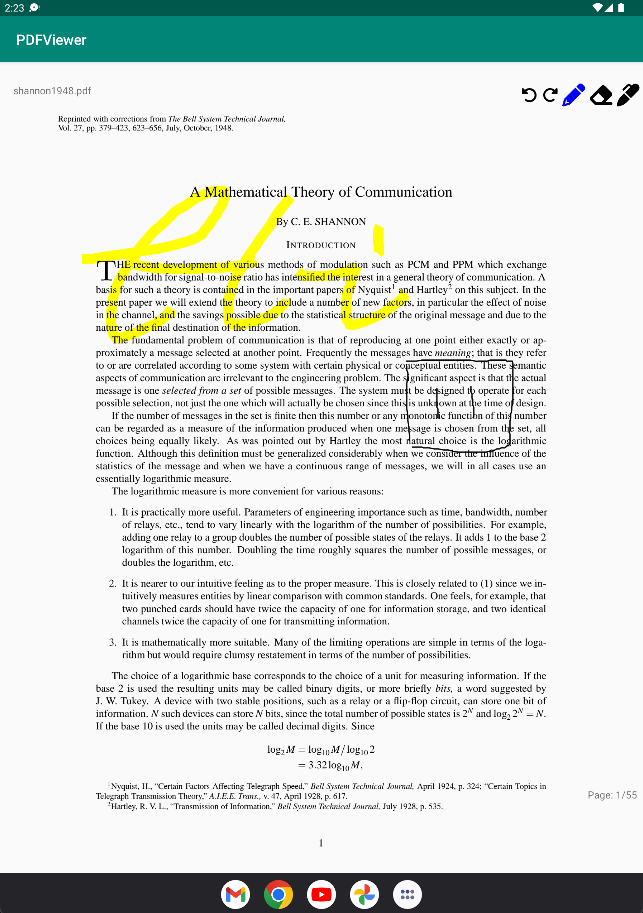

# whimNote
A PDF reader where user can read and annotate a document on an Android tablet. Provides orientation support.

# Specifications
- Swipe left or right to go to previous or next page respectively.
- To make annotations, click on the repsective icon - pencil or marker.
- To erase, draw a line with the eraser that crosses the path. It will remove the whole path after you lifted your finger.
- To undo/redo, click on the rotate left/right icons.
- To exit drawing or erase mode, click the icon again.
- Changing page will clear the undo/redo stack

# Testing
- This program is designed for Pixel C tablet AVD with API 29 or newer.